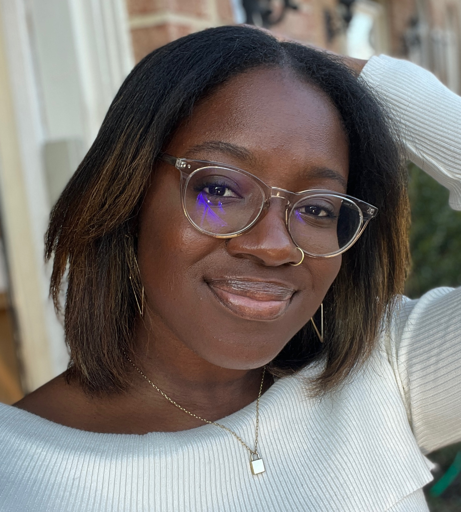
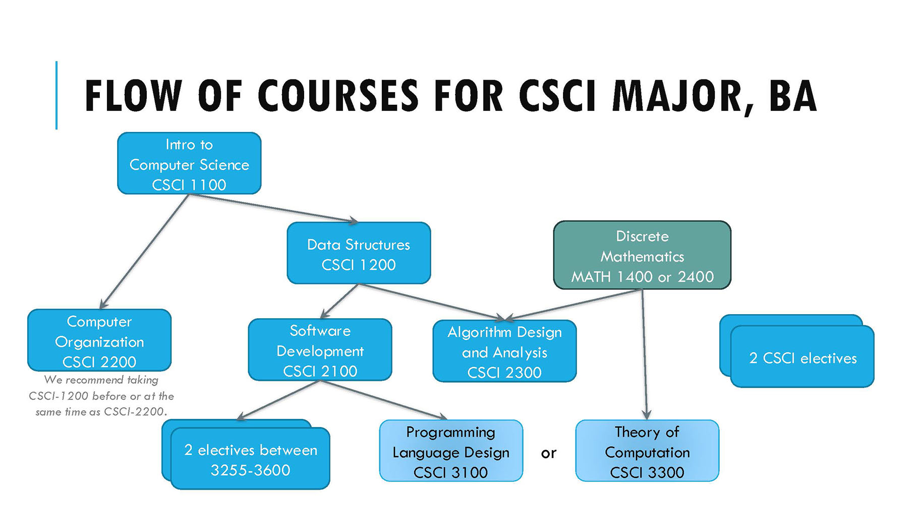
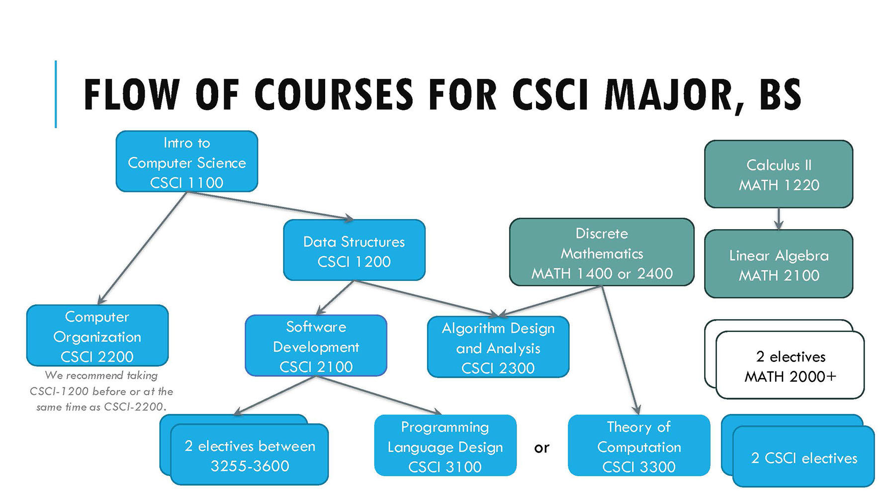

# About Computer Science
- != Programming
- Fun and engaging
- Unlocks human-focused and technical careers
	- Vanessa, User Experience Designer, Booz Allen Hamilton!
	
	
	
	- Mia, Machine Learning Engineer, Vanguard
	
	
	
	- Bella, Senior Software Engineer, Capital One
	- Rae, Software Development Engineer at Amazon Web Services
- proceeds from here with [more courses](https://www.wlu.edu/computer-science-department/about-the-department/required-courses-flow-chart)

# About the Course
- see [[Syllabus]]

# Technical Aspects of Computing
- solve problems (in abstract)
	- model world
	- make algorithms
- express yourself (in code) [languages](https://www.tiobe.com/tiobe-index/)
	- english etc.
	- python etc.
	- c
	- assembly
	- machine code
	- electricity
- use existing software
	- in your code
	- via terminal
	- with graphical interfaces
# Algorithms
- social media algorithms?
- problem solving steps
# Programs/Code
- express stuff (e.g. websites or images)
- express actions
- express reactions
# Python
- a language
- a program
	- made of code 
	- runs code

## References
- [Dr. Sprenkle's Lecture 0](https://cs.wlu.edu/~sprenkles/cs111/slides/00-intro.pdf)
- [W&L CS Website](https://cs.wlu.edu/)